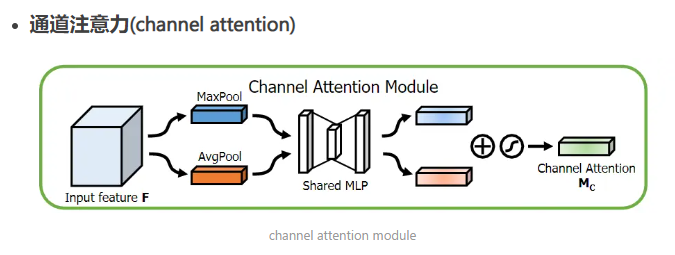

在哪里加注意力模块：

应该使用哪种注意力模块：

注意力模块参数如何设置：

------

- 添加注意力模块会导致模型的复杂度增加
- 模型要处于欠拟合状态，增加参数有利于学习，性能会提高


注意力模块的作用：增加模型的感受野大小，获取全局的上下文信息

viT在小数据集上性能不好，因为太关注全局性（并且参数量比较大），非常容易过拟合，记忆数据集的能力也比较强，所以只有大规模数据集预训练下才能取得更好的成绩。


#### CBAM模块：

作用：通过对特征图进行通道级和空间级的注意力调整，以提高网络的表达能力和感知能力。

如何实现：

- 通道注意力：首先，对输入的特征图进行全局平均池化和全局最大池化操作，得到两个向量。然后将这两个向量连接起来（concat），并通过两个全连接层（可包含RELU激活函数）生成一个通道注意力权重向量。该权重向量的维度与输入特征图的通道数相同。最后，将通道注意力权重向量与原始特征图进行逐元素相乘，以调整每个通道的重要性。



- 空间注意力：对输入的特征图分别进行不同尺度的卷积操作，例如1×1卷积和3×3卷积。这样可以捕捉不同空间位置上的重要信息。然后，通过在通道维度上进行最大池化和平均池化操作，得到两个特征图。接下来，将两个特征图相加，并应用sigmoid函数进行归一化，生成一个空间注意力权重图。该权重图的尺寸与输入特征图相同。最后将空间注意力权重图和原始特征图进行逐元素相乘，以调整不同空间位置的重要性。


代码：

```
import paddle
import paddle.nn as nn

class ChannelAttention(nn.Layer):
    def __init__(self, in_channels, reduction_ratio=16):
        super(ChannelAttention, self).__init__()
        self.avg_pool = nn.AdaptiveAvgPool2D(1)
        self.max_pool = nn.AdaptiveMaxPool2D(1)
        self.fc1 = nn.Conv2D(in_channels, in_channels // reduction_ratio, kernel_size=1)
        self.relu = nn.ReLU()
        self.fc2 = nn.Conv2D(in_channels // reduction_ratio, in_channels, kernel_size=1)
        self.sigmoid = nn.Sigmoid()

    def forward(self, x):
        avg_out = self.fc2(self.relu(self.fc1(self.avg_pool(x))))
        max_out = self.fc2(self.relu(self.fc1(self.max_pool(x))))
        out = avg_out + max_out
        return self.sigmoid(out)


class SpatialAttention(nn.Layer):
    def __init__(self, kernel_size=7):
        super(SpatialAttention, self).__init__()
        self.conv = nn.Conv2D(2, 1, kernel_size=kernel_size, padding=(kernel_size - 1) // 2)
        self.sigmoid = nn.Sigmoid()

    def forward(self, x):
        avg_out = paddle.mean(x, axis=1, keepdim=True)
        max_out = paddle.max(x, axis=1, keepdim=True)
        out = paddle.concat([avg_out, max_out], axis=1)
        out = self.conv(out)
        return self.sigmoid(out)


class CBAM(nn.Layer):
    def __init__(self, in_channels, reduction_ratio=16, kernel_size=7):
        super(CBAM, self).__init__()
        self.channel_att = ChannelAttention(in_channels, reduction_ratio)
        self.spatial_att = SpatialAttention(kernel_size)

    def forward(self, x):
        out = x * self.channel_att(x)
        out = out * self.spatial_att(out)
        return out


# 测试 CBAM 模块
input_data = paddle.randn([1, 64, 32, 32])  # 假设输入数据为 64 通道的 32x32 图像
cbam = CBAM(in_channels=64)
output = cbam(input_data)
print(output.shape)
```


#### 自注意力（Self-Attention）/注意力机制（Attention Mechanism）:

原理：

- 输入表示转换：
- 注意力权重计算：
- 注意力权重归一化：
- 加权求和：


```
# 定义注意力模块
class AttentionModule(nn.Module):
    def __init__(self, in_channels):
        super(AttentionModule, self).__init__()
        self.conv1 = nn.Conv2d(in_channels, in_channels, kernel_size=1)
        self.conv2 = nn.Conv2d(in_channels, in_channels, kernel_size=1)
        self.conv3 = nn.Conv2d(in_channels, in_channels, kernel_size=1)
        self.softmax = nn.Softmax(dim=1)

    def forward(self, x):
        # 通过三个卷积层计算注意力权重
        query = self.conv1(x)
        key = self.conv2(x)
        value = self.conv3(x)
        
        # 计算注意力权重
        attention_weights = self.softmax(torch.matmul(query.view(query.size(0), -1, query.size(-1)), key.view(key.size(0), key.size(1), -1)))
        
        # 将注意力权重应用到特征上
        attention_features = torch.matmul(attention_weights, value.view(value.size(0), -1, value.size(-1)))
        attention_features = attention_features.view(attention_features.size(0), attention_features.size(1), *x.size()[2:])
        
        # 将注意力特征与原始特征相加
        x = x + attention_features
        
        return x
```


参考：

https://www.jianshu.com/p/fcd8991143c8

