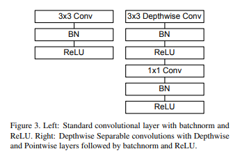

## [轻量化网络--网络模型加速](https://zhuanlan.zhihu.com/p/357348544)

好处：减少模型参数量和复杂度

### [方法：](https://ml.akasaki.space/ch3p2/[6]light-weight-network-design)

知识蒸馏、剪枝等模型压缩技术

#### 1.轻量化设计

采用**深度可分离卷积、分组卷积**等轻量卷积的方式

采用**全局池化来取代全连接层**

利用**1×1卷积**实现特征的通道降维==>channels shuffle(通道随机混合)

#### 2.知识蒸馏

使用大模型指导小模型训练保留大模型的有效信息

#### 3.网络剪枝

在卷积网络中存在大量接近0的参数，去掉后模型也可以基本达到相同的表达能力。

搜索网络中的冗余卷积核、将网络稀疏化--网络裁剪

两种：**训练中稀疏**、**训练后剪枝**

#### 4.量化

将网络模型中高精度的参数量化为低精度的参数，加速计算。

高精度的模型参数有更大的动态变化范围，能够表达更丰富的参数空间，因此训练中通常使用32位浮点数（单精度）作为网络参数模型。

训练后将32位浮点数化为16位浮点数的半精度，甚至int8的整型，0与1的二值类型，减少模型大小。

#### 5.低秩分解

因为原始网络参数中存在大量冗余，除了剪枝的方法外，

利用**SVD分解**和**PQ分解**，

将原始张量分解成低秩的若干张量，以减少卷积的计算，提升前向速度

### 评价指标

Params--网络参数量和FLOPs--浮点运算数

一般来说，网络模型参数量和 浮点运算数越小，模型的速度越快，但是衡量模型的快慢不仅仅是**参数量**、**计算量**的多少，还有**内存访问的次数多少相关，也就是和网络结构本身相关**。

### 轻量化网络

1. 优点（创新点）是什么
2. 在网络结构的哪使用的
3. 创新点的作用
4. 创新点是否可迁移
5. （若可迁移）去找创新点的代码,用pytorch或paddlepaddle表示

------

#### AlexNet

创新点：

- Group Convolution(分组卷积)

介绍：标准卷积的变体。

位置：用于在两个 GPU 上分配模型

好处：减少所需要的显存

代码：

#### [MobileNetv1](https://arxiv.org/pdf/1704.04861v1.pdf)

创新点：

- **将常规卷积替换成深度可分离卷积（depth-wise[深度卷积]和point-wise[点态卷积1×1卷积]）**
- 使用了全局平均池化层来代替全连接层（×，没有全连接层）

位置：卷积层

作用：减少网络参数和计算量

感觉可迁移



代码：Depthwise Separable Convolution

```
import torch.nn as nn

class DepthwiseSeparableConv2d(nn.Module):
    def __init__(self, in_channels, out_channels, kernel_size, stride=1, padding=0, dilation=1, bias=True):
        super(DepthwiseSeparableConv2d, self).__init__()
        self.depthwise_conv = nn.Conv2d(in_channels, in_channels, kernel_size=kernel_size, stride=stride, padding=padding, dilation=dilation, groups=in_channels, bias=bias)
        self.pointwise_conv = nn.Conv2d(in_channels, out_channels, kernel_size=1, stride=1, padding=0, dilation=1, groups=1, bias=bias)
        
    def forward(self, x):
        x = self.depthwise_conv(x)
        x = self.pointwise_conv(x)
        return x
```


#### [MobileNetv2](https://arxiv.org/abs/1801.04381v4)

创新点：

- 采用了invered residual block(倒残差模块)

位置：

好处：

- 引入一个线性瓶颈层（Bottleneck）
- 用扩张卷积（空洞卷积）
- 引入一种Dynamic Convolution(动态卷积层)


#### SqueezeNet


#### ResNet


#### SENet


#### [ShuffleNetv1](https://arxiv.org/pdf/1707.01083v2.pdf)

创新点：

- pointwise group convolution(点式群卷积)

位置：可替代1×1卷积的位置

好处：降低1×1卷积的计算复杂度，减少模型参数

深度可分离卷积中的 pointwise group convolution 的组数可以设置为输入通道数的平方根的整数部分
$$
k = \lfloor \sqrt{C} \rfloor

其中，C 表示输入特征图的通道数，\lfloor x \rfloor 表示向下取整函数。
$$
副作用：某个通道的输出只能从一小部分输入通道中导出，阻碍了特征通道之间的信息流动性

解决方法：Channel Shuffle for Group Convolution(通道随机混合)

代码：

```
import torch.nn as nn

class PointwiseGroupConv2d(nn.Module):
    def __init__(self, in_channels, out_channels, groups=1, bias=True):
        super(PointwiseGroupConv2d, self).__init__()
        self.groups = groups
        self.conv = nn.ModuleList([nn.Conv2d(in_channels // groups, out_channels // groups, kernel_size=1, stride=1, padding=0, dilation=1, bias=bias) for _ in range(groups)])
        
    def forward(self, x):
        group_size = x.size(1) // self.groups
        groups = [x[:, i*group_size:(i+1)*group_size] for i in range(self.groups)]
        outputs = [self.conv[i](groups[i]) for i in range(self.groups)]
        x = torch.cat(outputs, dim=1)
        return x
```


- Channel Shuffle for Group Convolution(通道随机混合)

位置：在深度可分离卷积或组卷积（group convolution）的1×1卷积后

好处：帮助信息在特征通道间流动

代码：

```
def channel_shuffle(x, groups):
	# n,c,h,w
    batch_size, num_channels, height, width = x.shape[0:4]
    assert num_channels % groups == 0, 'num_channels should be divisible by groups'
    # groups指定分组数，channels_per_group表示每组的通道数
    channels_per_group = num_channels // groups
    # reshape，将x的通道维度拆分
    x = paddle.reshape(
        x=x, shape=[batch_size, groups, channels_per_group, height, width])
    # transpose
    x = paddle.transpose(x=x, perm=[0, 2, 1, 3, 4])
    # reshape回原x的形状
    x = paddle.reshape(x=x, shape=[batch_size, num_channels, height, width])
    return x
```


