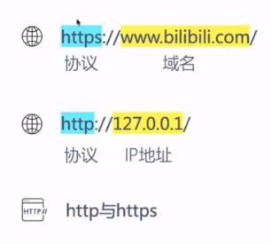

# [基础知识](https://space.keter.top/docs/others/%E5%89%8D%E5%90%8E%E7%AB%AF/%E6%89%93%E6%AF%94%E8%B5%9B%E5%BF%85%E5%A4%87%E7%9A%84%E5%89%8D%E5%90%8E%E7%AB%AF%E7%9F%A5%E8%AF%86)

### 网站基本结构

前端：浏览器

后端：功能接口

### 什么是网址



域名映射ip地址，因ip地址太难记

### 什么是ip地址

ip地址可以类比成收快递的地址，在本机查看输入ipconfig（Windows）

#### 公网ip和私网ip

公网ip可以在互联网直接访问，私网ip是在互联网搜不到的，无法访问

私网ip可以通过一定手段转换成公网ip

一片区域中对外使用统一的一个公网IP，在一个子网中使用私网IP

### web开发中的路由

指路功能，指向某些功能

### 什么是数据包

发送数据包==请求

两种方式：`GET`和`POST`

`GET`:从后端获取数据传输到前端，获取

`POST`:前端获取到的信息传输到后端，发送

前后端通信就是使用数据包进行通信

### 端口

每个端口都会提供一个服务

端口可以给数据包指路

在创建自己的服务的时候一般都选择3000以后的端口，否则可能会和系统内的某些服务冲突

# 前端三剑客

前端主要由三部分组成：**HTTL+CSS+JS**

HTML主要负责前端的基本框架，CSS主要负责调整网页的外观，JS负责处理页面的逻辑

## HTML基础知识

HTML是一种标签，以下是基本框架：


注意：只有<body>区域才会在浏览器显示

[一些常用的HTML元素](https://www.runoob.com/html/html-quicklist.html)

```html
<!-- 一级标题 -->
<h1>这是一个标题。</h1> 
<!-- 二级标题 -->
<h2>这是一个标题。</h2> 
<!-- 三级标题 -->
<h3>这是一个标题。</h3> 
<!-- 段落 -->
<p>这是一个段落 </p>
<p>这是另一个段落</p>
<!-- 加粗字体 -->
<b>这是一个加粗文本</b>
<!-- 超链接 -->
<a href="https://www.baidu.com/">访问Baidu</a>
<!-- 图像 -->

<!-- 输入框 -->
<input type="text">
<input type="password">
```

## [CSS基础语法](https://www.runoob.com/css/css-tutorial.html)

### 了解CSS

- CSS==层叠样式表
- 样式定义如何显示HTML元素
- 样式通常储存在样式表中
- 外部样式表可以提高工作效率
- 外部样式表通常存储在CSS文件中

### 创建CSS

#### 插入样式表的三种方式

`内联样式`

慎用这种方法

要使用内联样式，需要在相关的标签内使用样式（style）属性，style属性可以包含任何CSS属性

```html
<h1 style="color:brown;">hello</h1>
```

`内部样式表`

使用情况：单个文档需要特殊的样式时

如何使用：使用`\<style>`标签在文档头部定义内部样式表

```html
<head>
    <title>Document</title>
    <style>
        #a {color:cadetblue;}
    </style>
</head>
```

`外部样式表`

使用情况：当样式需要应用于很多页面时，可以通过改变一个文件来改变整个站点的外观

如何使用：每个页面使用`\<link>`标签链接到样式表

```html
<head>
<link rel="stylesheet" type="text/css" href="mystyle.css">
</head>
```

### CSS语法

CSS规则由两个主要的部分组成：选择器，以及一条或多条声明：


选择器通常是需要改变样式的HTML元素

每条声明由一个属性和一个值组成

属性是希望设置的样式属性，每个属性有一个值。属性和值被冒号分开。

### CSS的id和Class选择器

#### id选择器

可以为标有特定id的HTML元素指定特定的样式

HTML元素以id属性来设置id选择器，CSS中id选择器以“#”来定义

```
<!DOCTYPE html>
<html lang="en">
<head>
    <meta charset="UTF-8">
    <meta name="viewport" content="width=device-width, initial-scale=1.0">
    <title>Document</title>
    <style>
        #a {color: aqua;}
        #b {color: aquamarine;}
    </style>
</head>
<body>
    <p id="a">hello</p>
    <p id="b">welcome</p>
</body>
</html>
```

效果：


#### Class选择器

用于描述一组元素的样式，class选择器有别于id选择器，class可以在多个元素中使用

class选择器在HTML中以class属性表示，在CSS中，类选择器以一个点“.”号显示

```
<!DOCTYPE html>
<html lang="en">
<head>
    <meta charset="UTF-8">
    <meta http-equiv="X-UA-Compatible" content="IE=edge">
    <meta name="viewport" content="width=device-width, initial-scale=1.0">
    <title>Document</title>
    <style>
        #first {text-align: center;}
        #second {color: red;}
        .center {text-align: center;}
        h3.center {color: red;}
    </style>
</head> 
<body>
    <p id="first"> 第一个 </p>
    <p id="second"> 第二个 </p>
    <p id="third"> 第三个 </p>
    <p class="center"> 第三个 </p>
    <p class="center"> 第三个 </p>
    <p class="center"> 第三个 </p>
    <h3 class="center"> 第三个</h3>
    <h3 class="center"> 第三个</h3>
    <h3 class="center"> 第三个</h3>
    <h3 class="center"> 第三个</h3>
</body>
</html>
```

效果：


#### 区别

id只能绑定一个文件，不能重复；但是class可以重复使用

### CSS具体语法

上网查

实现：

```html
<!--用class选择器-->
<!DOCTYPE html>
<html lang="en">
<head>
    <meta charset="UTF-8">
    <meta name="viewport" content="width=device-width, initial-scale=1.0">
    <title>Document</title>
    <style>
        .a {text-align: center;}
    </style>
</head>
<body>
    <h1 class="a">mnist手写数字识别</h1>
    <p class="a">
        
    </p>
    <div class="a">
        <input type="file"name="选择文件">
        <input type="button"value="上传">
    </div>
    <div class="a">
        <p>识别结果：</p>
    </div>
</body>
</html>
```

```html
<!--用id选择器-->
<!DOCTYPE html>
<html lang="en">
<head>
    <meta charset="UTF-8">
    <meta name="viewport" content="width=device-width, initial-scale=1.0">
    <title>Document</title>
    <style>
        #a {text-align: center;}
    </style>
</head>
<body id="a">
    <h1>mnist手写数字识别</h1>
    <p>
        
    </p>
    <div>
        <input type="file"name="选择文件">
        <input type="button"value="上传">
    </div>
    <div>
        <p>识别结果：</p>
    </div>
</body>
</html>
```


## [JS基础知识](https://www.runoob.com/js/js-tutorial.html)

JavaScript，一种轻量级的编程语言，可插入HTML页面，可由现有浏览器执行

### JS的用法

脚本必须在`\<script>`与`\</script>`标签之间，可被放置在HTML页面的`\<body>`和`\<head>`部分中

```
<script>
alert("我的第一个 JavaScript");
</script>
```

浏览器会解释并执行位于`<script>` 和 `</script>`之间的 JavaScript 代码

### 写JS代码的三个位置

1. 在head中
2. 在body中
3. 在外置文件中

```html
 <!DOCTYPE html>
<html lang="en">
<head>
    <meta charset="UTF-8">
    <meta http-equiv="X-UA-Compatible" content="IE=edge">
    <meta name="viewport" content="width=device-width, initial-scale=1.0">
  <!-- 写在外置文件当中 -->
  <script src="myScript.js"></script>
    <title>Document</title>
  <!-- 写在head中 -->
  <script>
        document.write("<h1>223333</h1>");
    </script>
</head>
<body>
  <!-- 写在body中 -->1
    <script>
        document.write("<h1>1111</h1>");
        alert("哈哈");
    </script>
</body>
</html>
```

## JS语法

`声明变量`

```javascript
var x=1;
```

`数据类型`

```javascript
var length = 16;                                  // Number 通过数字字面量赋值    
var points = x * 10;                              // Number 通过表达式字面量赋值  
var lastName = "Johnson";                         // String 通过字符串字面量赋值  
var cars = ["Saab", "Volvo", "BMW"];              // Array  通过数组字面量赋值   
var person = {firstName:"John", lastName:"Doe"};  // Object 通过对象字面量赋值   
```

`JS函数`

```javascript
function myFunction(a,b){
    return a*b;
}
```

### 使用HTML元素触发函数

`onclick()`

```html
<body>
    <button onclick="myFunction()">点我啊</button>
    <script>
        function myFunction(){
            alert("aaaa");
        };
    </script>
</body>
<!--将button绑定myFunction()这个函数-->
```

`使用普通的JS代码绑定`

```html
<body>
    <button id="b1">点我啊</button>
    <script>
        function myFunction(){
            alert("aaaa");
        };
        var bt = document.getElementById('b1');
        bt.onclick = function(){
            myFunction();
        }
    </script>
</body>
<!--使用document.getElementById获取按钮这个对象，接着定义这个对象的onclick对应的事件-->
```

`使用JQuery库绑定`

JQuery是JS的一个库提供了一些比较好用的接口

引入JQuery库：

一般引入的代码写在head的位置

<script src="https://cdn.staticfile.org/jquery/1.8.3/jquery.min.js"></script>

```html
<body>
    <button id="b1">点我啊</button>
    <script>
        $("#b1").on("click",myFunction);
        function myFunction(){
            alert("aaaa");
        };
    </script>
</body>
```

除了点击，jq也可以便捷的实现鼠标移动到上面就触发的效果。把上述的代码改成mouseover即可；

更多内容可以上网查

## JQ的基本操作

### 基本语法格式

`$(selector).action()`

- 选择符（selector）查询HTML元素：this、标签名称、类名、#id
- jQuery的action（）执行对元素的操作

### JQ的选择器

`基本选择器`

| 选择器            | 描述                                     | 示例                            |
| ----------------- | ---------------------------------------- | ------------------------------- |
| #id               | 根据指定的ID匹配元素                     | $('#box')选择id为box的标签      |
| .class            | 根据给定的类名匹配元素                   | $('.left')选择class为left的标签 |
| Element           | 根据给定的元素名匹配元素                 | $('p')选择所有段落标签          |
| *                 | 匹配所有元素                             | $('*')选择所有不分类型标签      |
| Seletor1,Seletor2 | 将每一个选择器匹配到的元素合并到一起返回 | $('p,h1')同时选择段落和标题一   |

继承了CSS的风格，写法更加简洁

`层级选择器`

| 选择器     | 描述                             |
| ---------- | -------------------------------- |
| $('ul li') | 选择ul当中所有li（所有后代元素） |
| $('ul>li') | 选择ul当中子元素li所有的子元素   |
| $('p+div') | 选择段落后的第一个div            |

### JQ操作html元素

`获得内容`

- text() - 设置或返回所选元素的文本内容
- html() - 设置或返回所选元素的内容（包括 HTML 标记）
- val() - 设置或返回表单字段的值

`设置内容`

- text(参数) - 设置或返回所选元素的文本内容

- html(参数) - 设置或返回所选元素的内容（包括 HTML 标记）

- val(参数) - 设置或返回表单字段的值

- 回调函数： 回调函数由两个参数：被选元素列表中当前元素的下标，以及原始（旧的）值。然后以函数新值返回； 示例：

  ```js
   text(function(i,origText){
       return "Old text: " + origText + " New text: Hello world!
   }
  ```

## [Ajax](https://www.runoob.com/jquery/ajax-ajax.html)

不是新的编程语言，而是一种使用现有标准的新方法

优点：在不重新加载整个页面的情况下，可以与服务器交换数据并更新部分网页内容

不需要任何浏览器插件，但需要用户允许JavaScript在浏览器运行

# 后端Flask基础知识

学习网站：https://read.helloflask.com/c1-ready

一个使用python编写的轻量级web应用框架

安装：`pip3 install flask`


# 部署构思：

1. 先换成onnx模型
2. 安装tensorRT和CUDA
3. 设置优化参数，使用tensorRT把onnx优化成Engine，得到优化后的模型
4. 使用tensorRT Runtime API进行inference


参考：https://zhuanlan.zhihu.com/p/527238167

https://github.com/PaddlePaddle/FastDeploy/blob/develop/examples/runtime/python/README_CN.md

# 实操：

一、换成onnx模型

- 先下好包

```
pip install paddlepaddle paddle2onnx
```

- 加载和定义模型

```
import paddle

class YourModel(paddle.nn.Layer):
    def __init__(self):
        super(YourModel, self).__init__()
        # 在这里定义你的模型结构
        self.fc = paddle.nn.Linear(784, 10)

    def forward(self, x):
        # 在这里定义模型的前向传播逻辑
        x = self.fc(x)
        return x
```

```
import torch

class YourModel(torch.nn.Module):
    def __init__(self):
        super(YourModel, self).__init__()
        # 在这里定义你的模型结构
        self.fc = torch.nn.Linear(784, 10)

    def forward(self, x):
        # 在这里定义模型的前向传播逻辑
        x = self.fc(x)
        return x

# 创建模型实例
model = YourModel()

# 加载模型参数
model_path = 'path/to/model/parameters'
state_dict = torch.load(model_path)
model.load_state_dict(state_dict)
```

- 将模型转换成onnx格式

````
import paddle
from paddle2onnx import Paddle2ONNXConverter

# 加载并初始化模型
model = YourModel()
model_path = 'path/to/your/model'
state_dict = paddle.load(model_path)
model.set_state_dict(state_dict)

# 创建 Paddle2ONNX 转换器
converter = Paddle2ONNXConverter(model)

# 设置输入形状（根据你的模型输入要求设置）
input_shape = (1, 3, 224, 224)
converter.set_input_shape(input_shape)

# 执行转换并保存为 ONNX 文件
onnx_path = 'path/to/save/converted_model.onnx'
converter.convert(onnx_path)
```

将 `'path/to/your/model'` 替换为你的模型文件的路径，将 `'path/to/save/converted_model.onnx'` 替换为你要保存的 ONNX 文件的路径。`input_shape` 需要根据你的模型输入要求进行相应的设置。
````

二、下载tensorRT

- 注意要对应好版本

