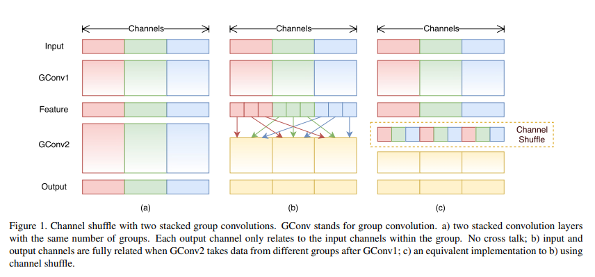
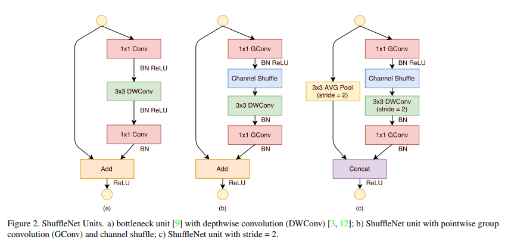

# [ShuffleNetv1](https://arxiv.org/pdf/1707.01083v2.pdf)

## 简单介绍：

因为之前的网络架构对小型网络低效，所以使用pointwise group convolution(点式群卷积)降低1×1卷积的计算量和复杂度，但是由于group convolution的副作用（还不知道是什么），所以同时使用channels shuffle(通道随机混合)构建了ShuffleNet。

## 相关工作：

Channels shuffle for Group Convolutions:

假设一个卷积层有 g 个组，
我们首先将输出通道维度重塑为 (g，n)，然后将其转置并扁平化，作为下一层的输入。
请注意，即使两个卷积
即使两个卷积的组数不同,操作仍然有效。

ShuffleNet Units:

一般在1×1GConv之后使用Channels Shuffle

