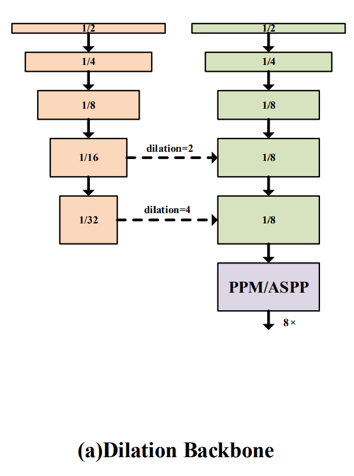
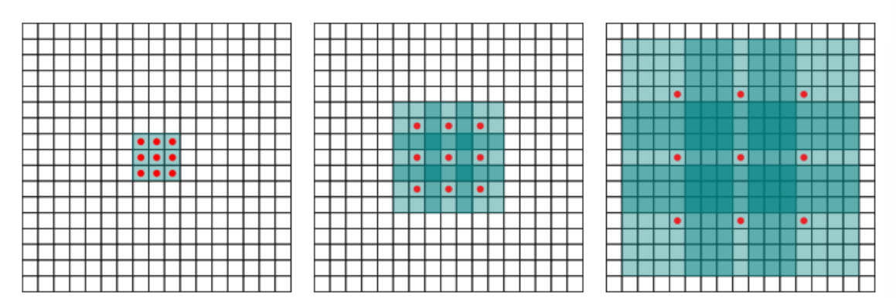
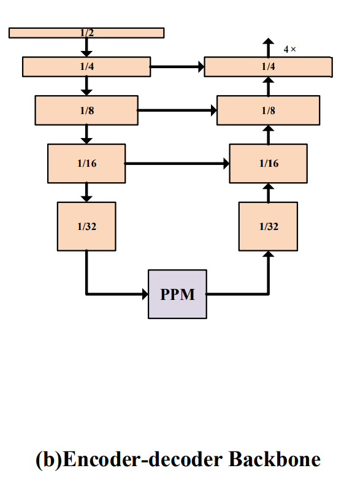
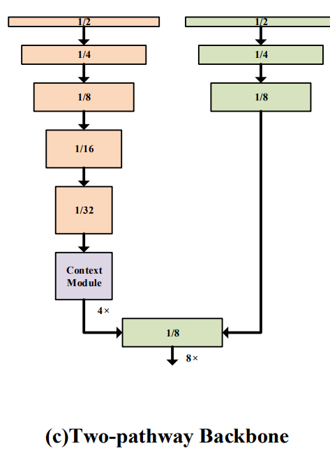
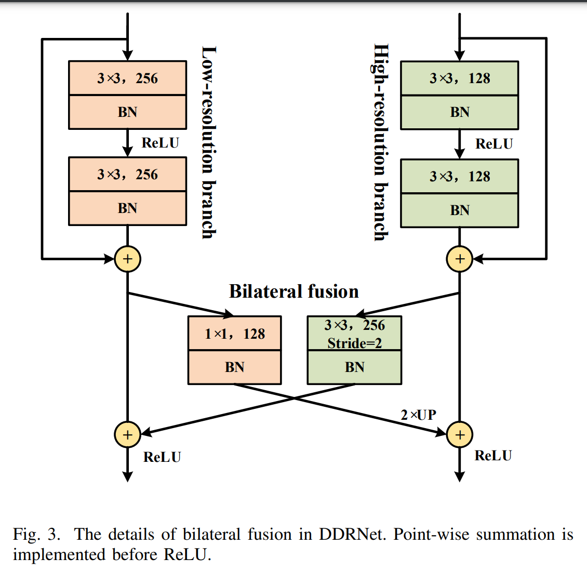
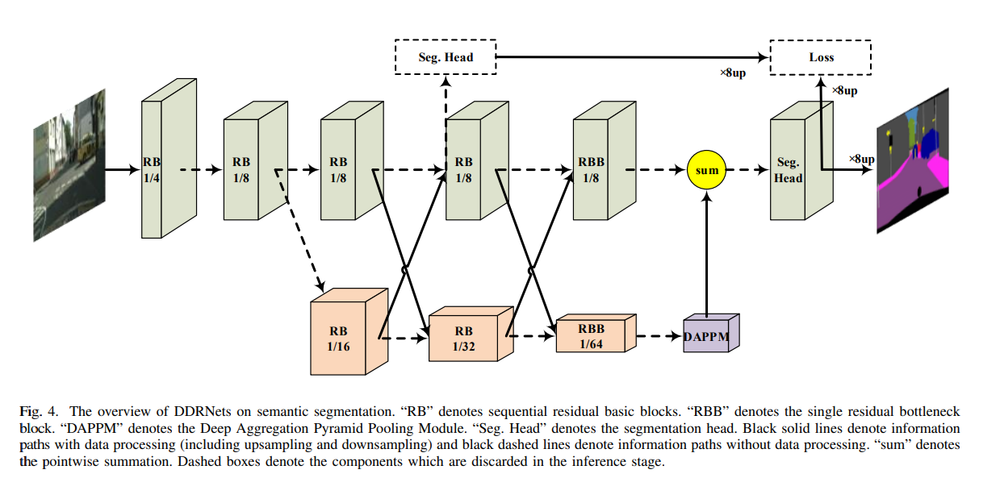
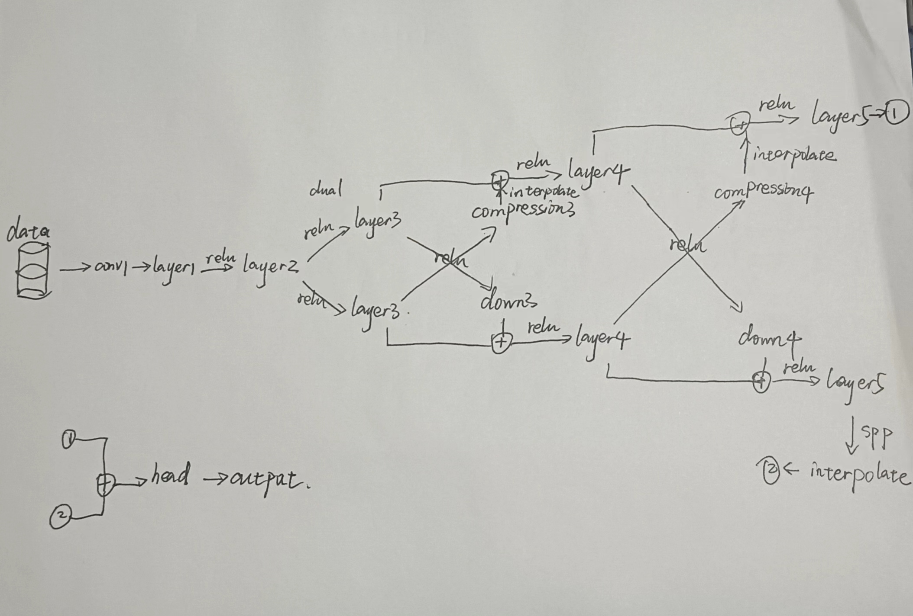
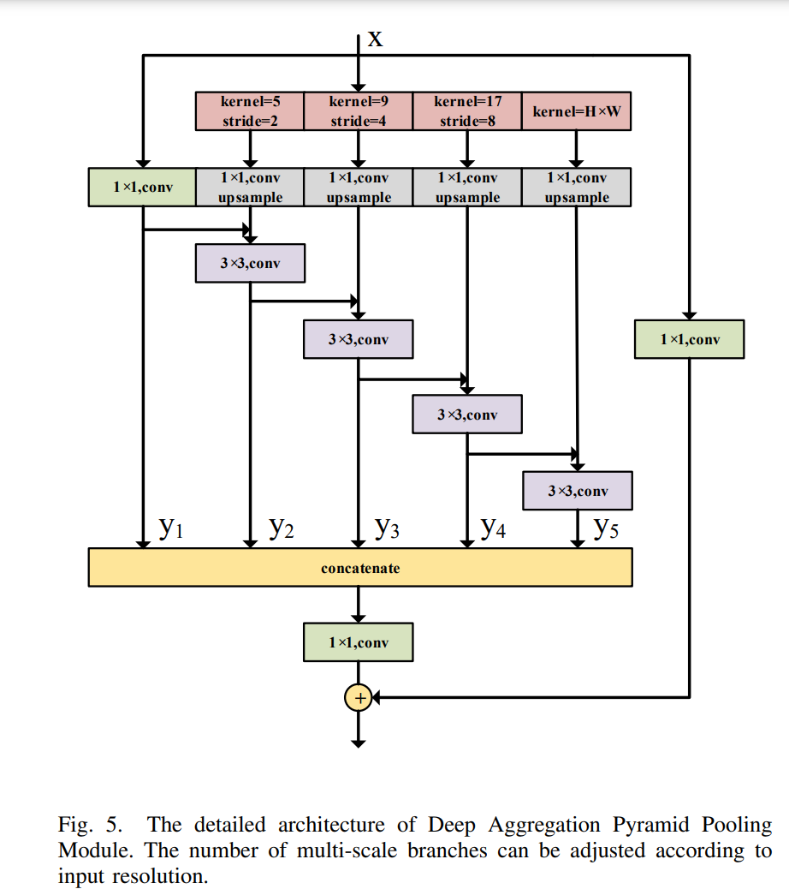
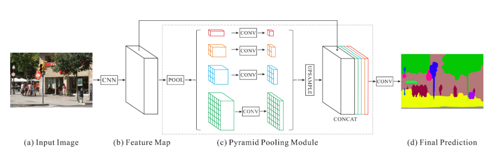

## [ddrnet](https://arxiv.org/pdf/2101.06085v2.pdf)

用来做什么：帮助理解周围的环境

数据集：Cityscapes CamVid COCOStuff

怎么实现的：

轻量化[encoder-decoder(解码器-编码器)或双分支]

上下文信息提取器-深度聚合金字塔池模块-DAPPM[优点：基于低分辨率特征图扩大有效感受野并融合多尺度背景图]

有什么效果：精度和速度平衡

------

### [介绍](https://parallel-judo-fe7.notion.site/DDRNet-c064dadff27248608b2eba88e454103a)

语义分割是一种密集预测任务，神经网络需要输出大感受野的高分辨率特征图才能产生令人满意的结果，在很多地方都可以应用，比如医学图像分割、自动驾驶、机器人。

#### 语义分割发展：

FCN->DeepLab[消除下采样(保持高分辨率)、利用大扩张的卷积(扩大感受野)]->DeepLabV2->DeepLabV3->PSPNet->DenseASPP

->DFANet[深度多尺度特征融合、轻量级深度可分离卷积]

作者提出了一种由空间路径和上下文路径组成的新型双边网络。
空间路径利用三个3×3的卷积层来捕捉空间细节。
上下文路径是一个紧凑的预训练骨干网络，用于提取上下文信息。

#### ddrnet简要认识：

从一个主干开始，分成两个并行的、具有不同分辨率的分支，一个深度分支生成相对高分辨率的特征图，另一个深度分支通过多次降采样操作提取丰富的语义信息。然后在两个分支之间建立多个双边连接，以实现高效的信息融合。还有一个DAPPM。

在训练之前需要在ImageNet上对双分辨率网络进行预训练。

#### 主要贡献：

- 为实时语义分割提出了一系列具有深度双分辨率分支和多双边融合的新型双边网络，作为高效的骨干。
- 通过结合特征聚合和金字塔池设计了一个新颖的模块，当在低分辨率特征图上执行时，它几乎不会增加推理时间。
- 精度和速度之间取得了平衡。

### 准备工作

上下文信息对于场景理解非常关键，将相关工作分为三类，高性能语义分割、实时语义分割和上下文提取模块。

#### 高性能语义分割

普通编码器最后一层的输出不能直接用于预测分段掩码，因为缺乏空间细节。有效感受野太小，无法学习高级语义信息，所以需要对分类骨干进行分类。

一种可行的策略是利用扩张卷积（空洞卷积）来建立像素间的远距离联系。在去除最后两层下采样的同时，建立像素之间的长远连接。

------

知识点补充：

##### [Receptive Field(感受野)](https://zhuanlan.zhihu.com/p/28492837)

形象一点的解释：表示convNets(cnn)每一层输出的特征图(feature map)上的像素点在原始图像上映射的区域大小。

表示网络内部的不同位置的神经元对原图像的感受范围的大小（我感觉像是站在不同地方的视角）

感受野的值可以大致用来判断每一层的抽象层次。

神经元感受野的值越大表示其能接触到的原始图像范围越大，意味着可能蕴含着更加全局、语义层次更高的特征；值越小表示器所包含的特征趋于局部和细节。

计算感受野的公式：
$$
r_n=r_{n-1}+(k_n-1)\prod\limits_{i=1}^{n-1}s_i
$$

$$
r_n表示第n个卷积层中每个单元的感受野;k_n表示第n个卷积层的kernel_size;s_n表示第n个卷积层的stride
$$

##### [Dilation Backbone(扩张卷积、空洞卷积）](https://blog.csdn.net/chaipp0607/article/details/99671483)

在标准的卷积核中注入空洞，以此来增加模型的感受野

dilation rate=卷积核的点的间隔数量+1 

对于图像分类来说，一个靠conv和pooling堆叠起来的backbone具有不错的特征提取能力，最经典的就是VGG。在图像输出网络中，conv提取特征，pooling做特征的聚合，并且让模型具有一定程度上的平移不变性，降低计算量，最后到全连接层输出分类结果就好了。

###### 但对于目标检测和图像分割来说，存在一些问题：

- 感受野很重要，保证感受野一般靠下采样，但是下采样的结果就是小目标不容易被检测到
- 针对以上问题，多层特征图拉取分支能改善这个问题，因为小目标在越靠前的特征图上越容易体现，但前面的特征图语义信息不够
- 不做下采样，增加卷积层的数量，会增大计算量，其次不做pooling的话，最后的特征提取效果也会受到影响，而且感受野不会变化。

扩张卷积是一种不牺牲特征图尺寸的情况下增加感受野的方式

从图一到图二dilation rate=2;从图一到图三dilation rate=4；

卷积核变大，但是实际参数只有九个

卷积核变大，则感受野变大

###### 空洞卷积存在问题：

虽然在不损失特征图尺寸的情况增大了感受野，但是在卷积的输入出现了一些问题。由于卷积核是有间隔的，意味着不是所有的输入都参与计算，整体特征图上会出现一种卷积中心点的不连续，尤其是dilation rate相同的时候。

###### 解决方法：

不使用连续的dilation rate相同的扩展卷积，但如果成倍数还是会存在该问题。

最好方式就是将连续排布的扩张卷积的dilation rate设置为“锯齿状”，比如分别是[1,2,3]

------

#### 实时语义分割

有两个基础的模块：解码器-编码器、双分支

##### encoder-decoder：

编码器通常是一个深度网络，通过反复的空间还原来提取上下文信息。

解码器通过插值或转置卷积来恢复分辨率，从而完成密集预测。

编码器可以是在ImageNet上预训练好的轻量级backbone或从头开始训练的高效变体。

SwiftNet：在ImageNet上预训练并且利用lightweight lateral connections(轻量级横向连接)来协助upsampling(上采样)。

FANet：快速注意模块和整个网络的额外下采样。

SFNet：流对齐模块(FAM)，对齐相邻层的特征图，从而更好地进行融合。

##### Two-pathway Architecture:

为什么要用双分支:虽然解码器-编码器能够减少计算量。但是在下采样的过程中会丢失一些细节信息

双分支能够很好的解决，一条提取语义信息，另一条高分辨率的浅层路径可以提供丰富的空间细节作为补充。

DDRNet的高分辨率分支可以实现多种特征融合和足够的特征融合和ImageNet预训练。

#### 上下文提取模块

自注意机制善于捕捉全局依赖性。

### 模型

#### DDRNet-23和DDRNet-39的区别：

中间卷积核的大小不同

#### DDRNet结构图

黑色实线表示经过数据处理（包括上采样和下采样）的路径，黑色虚线表示未经数据处理的信息路径，虚线框表示在推理阶段丢弃的成分。

#### DAPPM(Deep Aggregation Pyramid Pooling Module)

特征提取结构

concatenate维度拼接；1×1卷积，在不损失分辨率的前提下加深网络，提升网络的表达能力，实现信息的跨通道整合和交互，减少网络参数。

------

[PPM-Pyramid pooling module(金字塔池化模型)](https://blog.csdn.net/rocking_struggling/article/details/108550637)

是一个用于语义分割的模块。

包含不同尺度和不同子区域的信息。使用4级金字塔，池化核可以覆盖整个图像、图像的一半和图像的一小部分，被融合为全局先验。最后将先验图与原始特征图进行串联。

使用卷积网络（如ResNet）的动机是，虽然感受野已经大于输入图像，但经验感受野远小于理论感受野，使许多网络无法充分纳入重要的全局劲舞先验。

通过由多到少的池化，可以有效增大感受野，增大全局信息的利用效率。

------

#### 深度监督

监督学习和无监督学习的区别在于是否有标签数据。

监督学习用于分类和回归问题，无监督学习用于聚类、降维和异常检测等问题。

加了一个辅助损失来额外监督
$$
L_f=L_n+αL_a
$$
Lf、Ln、La 分别表示最终损失、正常损失、辅助损失，α 表示辅助损失的权重，在测试阶段为 0.4。

------

细节分析：

用的什么--双分支、信息融合、DAPPM、

为什么要用--

有没有改进--

改进了什么--

用在网络结构中作用是什么--

针对这个作用有没有更好的点

------

DDRNet的不足之处：

1. 计算复杂度较高：DDRNet在设计上注重了多尺度信息的融合和上下文感知，这导致了较高的计算复杂度。特别是对于较大的输入图像或高分辨率的任务，DDRNet可能需要更多的计算资源和时间来完成推理过程。
2. 内存占用较大：DDRNet中的多尺度信息融合和上下文感知需要存储和处理大量的特征图，这可能导致较高的内存占用。对于内存受限的设备或场景，这可能成为一个限制因素。
3. 参数量较大：DDRNet的设计中使用了大量的卷积和注意力机制，这导致了较大的模型参数量。大参数量的模型可能需要更多的存储空间和更长的训练时间，对于资源受限的环境可能不太适用。
4. 对于小目标的检测效果有限：DDRNet在密集预测任务（如语义分割）上表现良好，但对于小目标的检测效果可能有限。由于DDRNet的网络结构和多尺度信息融合机制，对于小目标的细节信息可能没有充分的捕捉能力。
5. 需要更多的训练样本：DDRNet作为深度神经网络，通常需要大量的训练样本来获得较好的性能。如果训练样本数量有限，DDRNet可能会面临过拟合或泛化能力不足的问题。

------

对于需要场景理解的任务来说，上下文信息非常重要。

扩大有效的感受野，原来用大的扩展卷积，但是在推理阶段非常耗时。

实时分割中，DFANet采用深度多尺度特征融合和轻量级深度可分离卷积。作者提出一个由空间路径和背景路径组成的新型双边网络。空间路径利用三个3×3卷积层来捕捉空间细节。上下文路径是一个紧凑的预训练骨干来提取上下文信息。

在本文中，作者提出了具有深度高分辨率表示的双分辨率网络。从一个主干开始，然后分成两个具有不同分辨率的平行深度分支。一个深层分支生成相对高分辨率的特征，另一个通过多次降采样操作提取丰富的语义信息。两个分支之间连接多个双边连接，以实现高效的信息融合。在DAPPM中，输入低分辨率的特征图，提取多尺度的上下文信息，并以级联的方式将它们合并。

