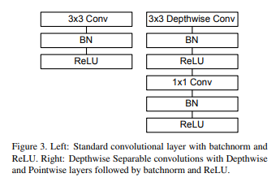

前期：

CNNs具体卷积过程

残差网络基本结构（ResNet）

激活函数的意义和优点

学习目标：

深度可分离卷积

构建方法和超参数概念

后续创新点

------

#### [MobileNetv1](https://arxiv.org/pdf/1704.04861v1.pdf)

创新点：

- **将常规卷积替换成深度可分离卷积（depth-wise[深度卷积]和point-wise[点态卷积1×1卷积]）**
- 使用了全局平均池化层来代替全连接层（×，没有全连接层）

位置：卷积层

作用：减少网络参数和计算量

感觉可迁移



代码：Depthwise Separable Convolution

```
import torch.nn as nn

class DepthwiseSeparableConv2d(nn.Module):
    def __init__(self, in_channels, out_channels, kernel_size, stride=1, padding=0, dilation=1, bias=True):
        super(DepthwiseSeparableConv2d, self).__init__()
        self.depthwise_conv = nn.Conv2d(in_channels, in_channels, kernel_size=kernel_size, stride=stride, padding=padding, dilation=dilation, groups=in_channels, bias=bias)
        self.pointwise_conv = nn.Conv2d(in_channels, out_channels, kernel_size=1, stride=1, padding=0, dilation=1, groups=1, bias=bias)
        
    def forward(self, x):
        x = self.depthwise_conv(x)
        x = self.pointwise_conv(x)
        return x
```


#### [MobileNetv2](https://arxiv.org/abs/1801.04381v4)

创新点：

- 采用了invered residual block(倒残差模块)

位置：

好处：

- 引入一个线性瓶颈层（Bottleneck）
- 用扩张卷积（空洞卷积）
- 引入一种Dynamic Convolution(动态卷积层)

