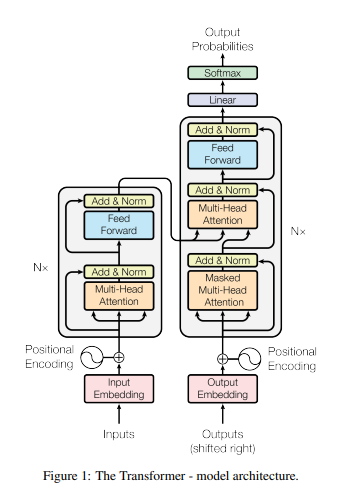
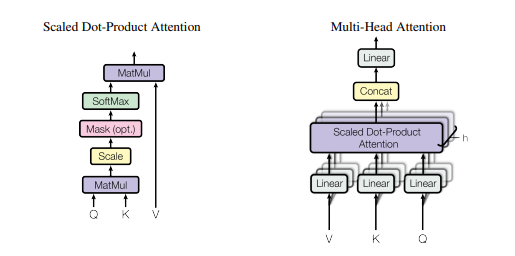

[transformer](https://arxiv.org/pdf/1706.03762.pdf)

用来做什么：

基于Transformer的架构主要用于建模语言理解任务，它避免了在神经网络中使用递归，而是完全依赖于self-attention机制来绘制输入和输出之间的全局依赖关系。

怎么实现的：

重点在self-attention上，还有encoder-decoder结构，详细如下。

有什么效果：

降低计算复杂度，增大最长路径长度

---------------------------------------------------------------

放弃循环和卷积，用注意力机制

- describe the Transformer

 Add & Norm 层，Add 表示残差连接 (Residual Connection) 用于防止网络退化，Norm 表示 Layer Normalization，用于对每一层的激活值进行归一化。

**编码器**：由N = 6个相同层的堆栈组成。每一层有两个子层。第一个是一个多头自注意机制，第二个是一个简单的、按位置完全连接的前馈网络。我们在每两个子层周围使用一个残差连接，然后进行层归一化。即每个子层的输出为
$$
LayerNorm(x +子层(x))
$$
，其中子层(x)是由子层本身实现的函数。为了方便这些残差连接，模型中的所有子层以及嵌入层产生的输出。

**解码器**：也由N = 6个相同层的堆栈组成。除了每个编码器层中的两个子层外，解码器还插入第三个子层，该子层对编码器堆栈的输出执行多头注意。与编码器类似，我们在每个子层周围使用剩余连接，然后进行层归一化。我们还修改了解码器堆栈中的自关注子层，以防止位置关注后续位置。

这种掩蔽，结合输出嵌入被一个位置抵消的事实，确保对位置i的预测只能依赖于小于i位置的已知输出。

$$
α_{i，j}代表了q_i与k_j点乘，相当于矩阵乘法，提高了运算速度
$$
[concat将得到的bi进行拼接（向量首尾相连）](https://zhuanlan.zhihu.com/p/365386753)

Linear线性转换（不含非线性激活层的单层全连接神经网络）得到结果b1

对Q,K,V的物理理解

把输入词向量用不同的W分成query(Q)，key(K)和value(K)三个部分。Q和K相乘可以看作一个retrieval的过程，Q是查询要求，K是候选结果的title，V是候选结果的具体内容。每个单词的Q和所有其他单词的K做匹配，看和各个单词的相关程度（也就是softmax得到的概率），这个相关程度去和每个单词的V做weighted sum，从各个单词中根据需要提取信息。

其实可以比作一个查字典的过程，Q就是决定了谁来翻动这本字典，用K去找到要查的东西在第几页（即用多少的权重参与进来），V就是我查到的东西是什么。

-  motivate self-attention

1. 可减小每层的总计算复杂度。
2. 可以并行化的计算量，可以通过所需的最小顺序操作数量来衡量。限制为只考虑大小为r的邻域输入序列以各自的输出位置为中心。这将使最大路径长度增加到O(n/r)。
3. 网络中长期依赖关系之间的路径长度。在许多序列转导任务中，学习长期依赖关系是一个关键的挑战.影响学习这种依赖关系能力的一个关键因素是向前和向后信号在网络中必须遍历的路径长度。输入和输出序列中任意位置组合之间的路径越短，就越容易学习长期依赖关系。因此，我们也比较了网络中任意两个输入和输出位置之间的最大路径长度。

-  discuss its advantages over models 

[辅助理解transformer](https://zhuanlan.zhihu.com/p/82312421)

[详细过程+解读图](https://zhuanlan.zhihu.com/p/338817680)    [youtube原出处](http://jalammar.github.io/illustrated-transformer/)

[十六问题加解](https://zhuanlan.zhihu.com/p/165510026#:~:text=Transformer,%E4%BD%9C%E7%94%A8%E6%98%AF%E4%BB%80%E4%B9%88%EF%BC%9F%20%E5%9F%BA%E4%BA%8ETransformer%E7%9A%84%E6%9E%B6%E6%9E%84%E4%B8%BB%E8%A6%81%E7%94%A8%E4%BA%8E%E5%BB%BA%E6%A8%A1%E8%AF%AD%E8%A8%80%E7%90%86%E8%A7%A3%E4%BB%BB%E5%8A%A1%EF%BC%8C%E5%AE%83%E9%81%BF%E5%85%8D%E4%BA%86%E5%9C%A8%E7%A5%9E%E7%BB%8F%E7%BD%91%E7%BB%9C%E4%B8%AD%E4%BD%BF%E7%94%A8%E9%80%92%E5%BD%92%EF%BC%8C%E8%80%8C%E6%98%AF%E5%AE%8C%E5%85%A8%E4%BE%9D%E8%B5%96%E4%BA%8Eself-attention%E6%9C%BA%E5%88%B6%E6%9D%A5%E7%BB%98%E5%88%B6%E8%BE%93%E5%85%A5%E5%92%8C%E8%BE%93%E5%87%BA%E4%B9%8B%E9%97%B4%E7%9A%84%E5%85%A8%E5%B1%80%E4%BE%9D%E8%B5%96%E5%85%B3%E7%B3%BB%E3%80%82)

- transformer和self-attention的区别

首先，transformer是一种深度学习模型，而self-attention是transformer模型中使用的一种重要技术。

self-attention用来捕捉输入序列中的上下文信息。通过将输入序列中的每个元素与其他元素进行比较，从而计算出每个元素与整个序列的相关性权重，然后，它通过对所有元素的权重进行加权求和来计算每个元素的表示，从而得到一个新的表示向量。（将输入序列中的每个元素“注意力”到其他元素上）。

总的来说，Transformer是一种基于自注意力机制的序列模型，可以用于处理自然语言文本等序列数据。Self-Attention是Transformer模型中的一种重要技术，用于捕捉输入序列中的上下文信息。因此，可以说Self-Attention是Transformer模型的一个组成部分，而Transformer模型则是在Self-Attention的基础上构建的一种更加复杂的模型。

除了用于Transformer模型中，Self-Attention也可以应用于其他类型的神经网络模型中，例如卷积神经网络（CNN）和循环神经网络（RNN）。在这些模型中，Self-Attention被用于从序列数据中提取关键信息，类似于Transformer模型中的作用。与传统的CNN和RNN模型相比，使用Self-Attention可以帮助模型更好地处理序列数据中的长距离依赖关系和上下文信息，从而提高模型的性能。

另外，Self-Attention还有一些变种形式，例如Multi-Head Attention和Scaled Dot-Product Attention。Multi-Head Attention可以将Self-Attention计算过程分成多个子空间，并在每个子空间中进行独立的Attention计算，从而增加模型的表达能力。Scaled Dot-Product Attention则是一种优化的Self-Attention形式，可以在计算Attention权重时引入缩放因子，避免在计算过程中出现梯度消失或爆炸等问题。

在自然语言处理领域中，Self-Attention已经成为了一种非常重要的技术，被广泛应用于多个任务中，例如文本分类、命名实体识别、机器翻译等。使用Self-Attention可以帮助模型更好地处理输入序列中的上下文信息，从而提高模型的性能。同时，Self-Attention也成为了一种非常活跃的研究领域，有很多研究者致力于改进和优化Self-Attention的计算方式，从而提高模型的效率和性能。

总的来说，Transformer和Self-Attention是自然语言处理领域中非常重要的技术，它们的出现使得神经网络模型能够更好地处理序列数据，特别是在自然语言处理任务中取得了很好的成绩。

- [transformer的实现过程](https://blog.csdn.net/wl1780852311/article/details/121033915)

[关于embedding的理解](https://zhuanlan.zhihu.com/p/164502624)：

把文字转化成one-hot可以便于计算机理解，但是文字太多，形成的矩阵太大，就会变成稀疏矩阵，非常占用空间。所以embedding可以用来降维，原来非常大的矩阵乘于一个权重矩阵就会使矩阵缩小，达到降维的效果。同时embedding还可以升维，升降维的效果相当于放大缩小视角以达到最好视角。

