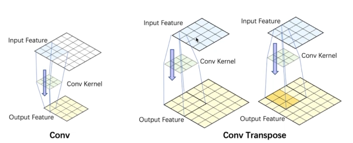
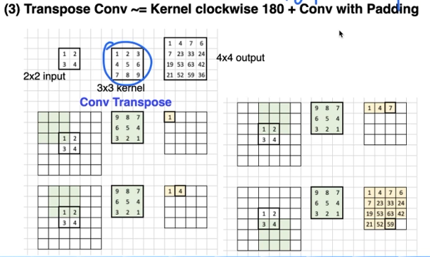

### 图像分割的类型

- 图像分割（前景，后景分割）
- 图像语义分割：给每个pixel分类
- 图像实例分割：给每个框里的object分mask
- 图像全景分割：背景pixel分类+框里mask
- 视频目标分割：通常给目标mask，求特定目标的mask
- 视频实例分割：根据目标检测的框，求目标的mask


### 应用


### 语义分割

根本目的：**像素级分类**

就是把每个像素都打上标签（像素点为人，树，背景等）

语义分割值区分类别，不区分类别中具体单位（分大类别）


一一比对，对了＋1，最后acc=right/sum


### 实例分割

不光区别类别，还要区别类别中每一个个体


逐像素的交叉熵/做二分类

交叉熵损失函数公式：


正负样本（多少）

### focal loss

（多少，难易）

样本也有难易之分，越难权值越高


### IOU计算（交并比）

#### MLOU指标

MLOU就是计算所有类别的平均值，一般当作分割任务评估指标


卷积参数

步长strides（小-->特征比较丰富） 

卷积核尺寸filter（小-->特征比较丰富）

填充pad


#### up samper上采样


##### [插值算法](https://zhuanlan.zhihu.com/p/110754637)

插值指利用已知的点来“猜”未知的点，图像领域插值常用在修改图像尺寸的过程，由旧的图像矩阵中的点计算新图像矩阵中的点并插入，不同的计算过程就是不同的插值算法。

插值算法有很多种，这里列出关联比较密切的三种：
[`最近邻法(Nearest Interpolation)`：](https://theailearner.com/2018/12/29/image-processing-nearest-neighbour-interpolation/)

计算速度最快，但是效果最差。
[`双线性插值(Bilinear Interpolation)`：](https://theailearner.com/2018/12/29/image-processing-bilinear-interpolation/)

双线性插值是用原图像中4(2×2)个点计算新图像中1个点，效果略逊于双三次插值，速度比双三次插值快，属于一种平衡美，在很多框架中属于默认算法。
`双三次插值(Bicubic interpolation)`：

双三次插值是用原图像中16(4×4)个点计算新图像中1个点，效果比较好，但是计算代价过大。

##### Un-pooling

pooling 反向操作

un-pooling forward需要index(也可以随机生成)

##### Transpose Conv





卷积逆操作：卷积核旋转180°+input padding（通过公式计算【通过output的f逆推出input的f】）


### [医学图像分割预处理](https://zhuanlan.zhihu.com/p/112176670)

[归一化方法](https://www.zhihu.com/question/379900540/answer/1411664196)：

如果是CT，可以首先统计一下金标准mask所覆盖的前景目标的灰度值的以下特征：

1.均值

2.方差

3.去最小0.5%极端值后的最小值（简称0.05%最小值）

4.去最大0.5%极端值后的最大值（简称99.5%最大值）

然后采用以下规则进行归一化：

1.clip掉0.5%最小值以下的值和99.5%最大值以上的值：

2.减均值除以方差

mr的话，因为磁场和各种参数的原因，同一个组织在不同次扫描里面灰度值并不太固定，所以不建议采用以上方法。

建议直接最大最小值(也可以用去0.5%的极值)归一化到正负1或0,1之间。


CT图像采用截断归一化比较多一些，即采用感兴器官或组织的窗宽-窗位(最小最大值)去截断灰度范围，然后归一化到[0, 1]或[-1,1]。


CT图像中不同仿射剂量（单位：`HU`） 会对应人体不同的组织器官


归一化处理：

```
#设置边界
MIN_BOUND=
MAX_BOUND=

def 
```


[各区里面所包括的脏器与器官](https://zhuanlan.zhihu.com/p/326305409)

①左上腹部：胃，脾，结肠脾曲，胰尾，左肾上腺，左肾；②左侧腰部，降结肠，空肠或回肠，左肾下部；③左下腹部，乙状结肠，女性左侧卵巢及输卵管，男性左侧精索，淋巴结；④上腹部：肝左叶，胃幽门端，十二指肠，胰头和胰体，大网膜，横结肠，腹主动脉；⑤中腹部：大网膜，下垂的胃或横结肠，十二指肠下部，空肠或回肠，输尿管，腹主动脉，肠系膜及淋巴结；⑥下腹部，回肠，输尿管，乙状结肠，胀大的膀胱，增大的子宫；⑦右上腹部；肝右叶，胆囊，部分十二指肠，结肠肝曲，右肾上腺，右肾；⑧右侧腰部：升结肠，空肠，部分十二指肠，右肾下部；⑨右下腹部：盲肠，阑尾，回肠下端，淋巴结，女性右侧卵巢及输卵管，男性右精索。总结:扫描中的上腹部包括左上腹部、上腹部及右上腹部扫描中的中腹部包括左侧腰部、中腹部及右侧腰部扫描中的下腹部包括左下腹部、下腹部及右下腹部


[关于各个器官的hu值](https://www.jianshu.com/p/3778324574d4)

[数据预处理例子](https://blog.csdn.net/m0_63642362/article/details/123297228)

```
HUnorm的HU-max和HU-min
# 转换成窗宽窗位
        min = (2 * center - width) / 2.0 + 0.5
        max = (2 * center + width) / 2.0 + 0.5
 # 腹部 ww 300-500 wl 30-50
        center = 40
        width = 500
```


#### patch_training

工作中要对高分辨率图像(至少1024 ×× 1024)进行分类，而且ground-truth分类的标准一般都是取决于像素级别的精细local feature（e.g. texture），图像中大致的global feature (e.g. spatial arrangement)不是很重要。大多数生物医学图像分类都属于这类，这就导致了很多传统的CNN不适用于医学图片的分类，比如AlexNet， VGG等。

论文[Patch-based Convolutional Neural Network for WholeSlide Tissue Image Classification]为此类问题提出了 一个解决方案。基本原理就是把一个高分辨率图像分成很多小patch，然后对每个patch做patch-level classification，最后集合patch-level classification得到一个image-level classification。


