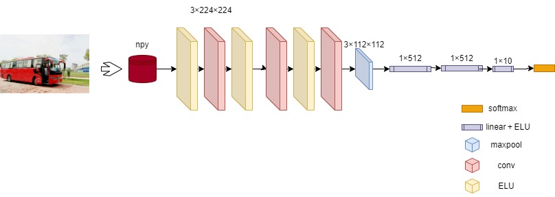

基于numpy使用cnn实现图像分类

### 如何实现：

#### 数据集的准备以及一些介绍：

数据集使用的是车辆图像数据集，有10个类别，类别包括：bus、taxi、truck、family sedan、minibus、jeep、SUV、heavy truck、racing car、fire engine

使用的开发语言是：python；

用到的工具包为：numpy、matplotlib、cv2、pyqt；

使用的算法：神经网络算法

#### 数据预处理：

首先按照8:2的比例划分训练集和验证集，然后把同一类别的放在同一个文件夹，然后生成有着绝对路径下每张图片的路径的txt文本。然后自己写了一个dataset和dataloader。在dataset中，生成了一个字典，将图片路径放入字典中，方便后续读取；读取图片将图片裁剪成（224，224）形状，然后归一化，防止数据太大导致神经元全部死亡。图像的亮度、对比度等属性对图像的影响是非常大的，相同物体在不同的亮度，对比度下差别非常大。在图像识别的问题中，我们经常会遇到阴影、强曝光之类的图片，这些因素都不应该影响最后的识别结果，所以对图像进行预处理，使得得到的神经网络模型尽可能小的被无关因素所影响。有时物体拍摄的角度不同，也会有很大的差异，所以刻意将图像进行随机的翻转，可以提高模型健壮性。

首先，我们按8:2的比例划分训练集和验证集，并将同一类别的图像放在同一个文件夹中。然后，我们生成了一个包含绝对路径下每张图片的路径的txt文本，以方便后续读取。接着，我们自己编写了一个dataset和dataloader。在dataset中，我们生成了一个字典，将图片路径放入其中，以便后续读取。在读取图像时，我们将它们裁剪成（224，224）的形状，并进行归一化处理，以避免数据过大导致神经元全部死亡。图像的亮度、对比度等属性对图像的影响非常大，相同物体在不同的亮度、对比度下也会出现差别。为了确保最终的识别结果不会受到这些因素的影响，我们需要对图像进行预处理，使得神经网络模型尽可能少地受到无关因素的影响。此外，由于物体拍摄的角度不同也会对图像产生很大的差异，因此我们可以刻意将图像进行随机翻转，以提高模型的鲁棒性。这些数据预处理步骤可以帮助我们提高模型的性能和泛化能力，从而实现对车辆图像的准确分类。

#### CNN模型的结构和参数设置：

首先经过了数据预处理把数据变成了npy形式，然后经过大小为3×3的卷积核，padding为1，这样的好处是使图像大小不变，再经过ELU激活层，以上的过程重复三次，然后经过最大池化层maxpool，再经过线性层将输入拉平变成一个矩阵，加快计算速度，然后再经过激活层，再经过一个线性层，使矩阵变成1×10，经过softmax得出分类结果。

首先，我们对数据进行了预处理，将其转换为NPY格式。接下来，我们使用大小为3×3的卷积核，并使用padding=1的方法来确保图像大小不变。这个过程重复了三次，并在每一次卷积后添加了ELU激活层以加强模型的非线性能力。之后，我们使用maxpool最大池化层来降低维度。接着，我们将池化后的图像数据拉平成一个矩阵，以加速计算。然后，我们再次使用激活层，接着是一个线性层，将矩阵转换为1×10的形式。最后，我们使用softmax函数得出分类结果。这个过程可以帮助我们实现对车辆图像的准确分类，提高模型的性能和泛化能力。

参数设置：

batch size：8

学习率：0.001

训练集数量：1400

#### 模型的训练和优化：

这篇文章介绍了如何使用NumPy和CNN实现图像分类。首先，作者解释了CNN的工作原理和其在图像处理中的应用。然后，作者展示了如何使用NumPy创建CNN模型，并使用MNIST数据集进行训练和测试。作者通过实现卷积层、池化层和全连接层等组件来搭建模型，同时使用交叉熵损失函数和梯度下降优化器对模型进行训练。最后，作者展示了模型在测试集上的分类准确率达到了很高的水平。这篇文章提供了一个简单而有效的方法，用于初学者了解CNN和图像分类的基础知识，并在NumPy中实现模型的过程。

当进行机器学习或深度学习任务时，数据集的准备是非常重要的一步。在本项目中，我们使用了车辆图像数据集，该数据集包含10个类别，分别是：公交车、出租车、货车、家用轿车、面包车、吉普车、SUV、重型卡车、赛车和消防车。在数据集准备阶段，我们首先需要对图像数据进行预处理，包括图像大小调整、灰度化、归一化等操作。然后，我们需要将数据集划分为训练集、验证集和测试集。训练集用于训练模型，验证集用于调整模型参数和防止过拟合，测试集则用于评估模型的性能。在数据集准备阶段，还需要注意数据集的平衡性，确保每个类别的样本数相对均衡，以避免模型对某些类别过于偏向。通过完善的数据集准备，可以提高模型的性能和泛化能力。

在本项目中，我们使用神经网络算法进行车辆图像分类。模型的训练是一个非常重要的步骤，它可以帮助我们优化模型的参数，从而提高模型的性能和泛化能力。以下是模型训练的一些步骤：

1. 定义模型：我们首先需要定义模型的架构，包括卷积层、池化层、全连接层等组件。
2. 定义损失函数和优化器：我们需要选择合适的损失函数和优化器来训练模型。在本项目中，我们选择了交叉熵损失函数和梯度下降优化器。
3. 进行训练：我们使用训练集来训练模型，并使用验证集来调整模型参数和防止过拟合。在每次训练迭代中，我们将数据输入模型中，并计算损失函数和梯度。然后，我们使用优化器来更新模型参数。
4. 进行测试：训练完成后，我们使用测试集来评估模型的性能。通过计算模型在测试集上的准确率、精确率、召回率等指标，来评估模型的性能。

在训练过程中，我们还可以使用一些技巧来提高模型的性能，例如学习率调整、批量归一化、dropout等。通过不断地调整模型参数和训练方法，我们可以逐步提高模型的性能，实现对车辆图像的准确分类。
