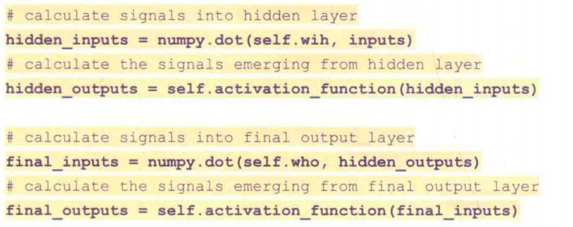
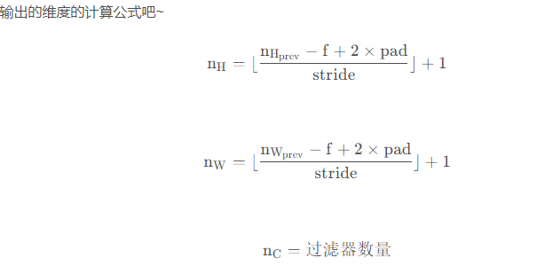
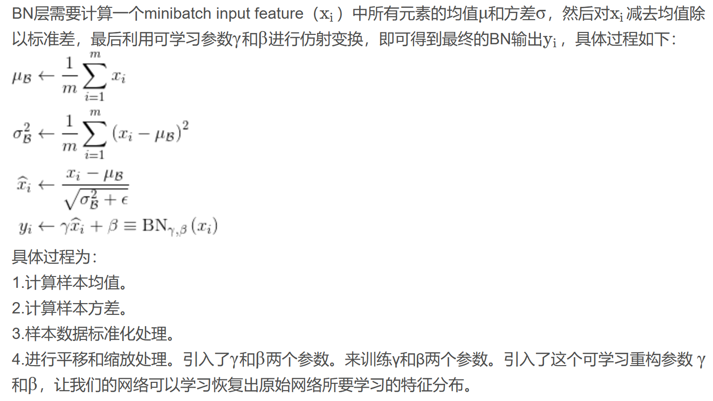

#### 预测器

在输入和输出之间进行某种类型计算，用模型来猜测如何运行，再用误差来不断调整内部参数，改进这个模型

#### 分类器

训练数据：用来训练预测器或分类器的真实实例

若改进后的模型只与最后一次训练样本最匹配，忽略之前的样本，可用调节参数L（学习率）调节改进速率，适度改进

适度更新有助于限制错误样本影响

可以用多个线性分类器来划分由单一直线无法分离的数据

#### 逻辑函数（激活函数的阈值）sigmoid函数：


神经网络通过调整优化网络内部的链接权重改进输出，一些权重可能会变成零（实际上是被断开了）

神经网络第一层节点是输入层，不对输入值应用激活函数

用权重调节信号，应用S激活函数

用矩阵乘法计算

点乘或内积就是初学的矩阵乘法

链接权重：使用误差来指导在网络内部如何调整一些参数

#### 过程：

组合输入信号，应用链接权重调节这些输入信号，应用激活函数，生成这些层的输出信号。


W input_hidden输入层到隐藏层之间的权重


还要对这些节点应用S激活函数，生成中间隐藏层输出矩阵

W hidden_output隐藏层和输出层的链接权重

下一步，将神经网络的输出值与训练样本的输出值进行比较，计算出误差。

用误差来调节神经网络本身，进而改进神经网络的输出值。

#### 反向传播：

使用权重，将误差从输出向后传播到网络中。

将误差值按权重的比例进行分割，计算出每条链接相关的特定误差值。

更新权重：


隐藏节点的误差，通过重组链接的误差得到

#### （过程矢量化）使用矩阵乘法进行反向传播误差

起点是最终输出层中出现的误差


得到隐藏层矩阵


#### 梯度下降法

误差函数斜率：（目标值-实际值）平方


除了权重Wj,k所链接的节点，其他节点都可以删除，因为没有关联。

节点的输出只取决于所连接的链接（链接权重）


求导

化简


假设α（学习率）调节变化的强度，是一个常数

算出变化率


再更新权重


#### 大概流程


#### 准备数据

##### 输入

权重的改变不仅取决于激活函数的梯度（尽量保持小的输入），也取决于输入信号Oj(输入信号不能太小，会丧失精度)

重新调整输入值（0.0~1.0）

##### 输出

目标值如果在不可能达到的范围，训练网络会驱使更大的权重，以获得越来越大的输出

重新调整目标值（0.01~0.99）

##### 随机初始权重

避免大的初始权重值，以免降低网络学习到更好的权重的能力

在一个节点传入链接数量平方根倒数的大致范围内随机取样

不能将初始权重设定为相同的恒定值，尤其是0，因为网络会得到相同的权重（输入0网络会失去更新权重的能力）


把神经网络构建为对象，接受某些输入，计算后再输出。（训练神经网络）

神经网络内部的数据就是链接权重

##### 偏置值b

权重改变激活函数的陡峭程度，偏置将激活函数左右移位

理解：也可以看作每个神经元多了一个参数w0*x0（x0=1，w0=b）

实质：对神经元激活状态的控制阈值

作用：更好的拟合数据

初始化：
$$
w=a+\sqrt{b} × randn(m,n)
$$
a为均值，b为方差，m和n代表权重矩阵的维度

```
self.biases=np.random.randn(y,x)/np.sqrt(x)
```

使用：

```
final_output=np.dot(self.who,final_inputs)+b
```


### 神经网络构建

三个函数：

初始化函数--设定输入层节点、隐藏层节点和输出层节点的数量

训练--学习给定训练集样本后，优化权重

查询--给定输入，从输出节点给出答案

初始的框架：

```
class neuralNetwork:
    def __init__(self):#初始化
        pass

    def train(self):#训练
        pass

    def query(self):#查询
        pass
```

#### 初始化网络

这些节点数量定义了神经网络的形状和尺寸（数量不固定）

```
def __init__(self,inputnodes,hiddennodes,outputnodes,learningrate):#初始化
        self.inodes=inputnodes
        self.hnodes=hiddennodes
        self.onodes=outputnodes
        self.lr=learningrate
        pass
```

这样就可以输入节点数量啦

#### 权重——网络的核心

下一步就是创建网络的节点和链接

使用权重来计算前馈信号、反向传播误差，并且在试图改进网络时优化链接权重本身


初始化权重

```
self.wih = (np.random.rand(self.hnodes, self.inodes) - 0.5)
self.who = (np.random.rand(self.onodes, self.hnodes) - 0.5)
```

```
self.wih = np.random.normal(0.0,pow(self.hnodes,-0.5),(self.hnodes,self.inodes))
self.who = np.random.normal(0.0,pow(self.onodes,-0.5),(self.onodes,self.hnodes))
#中心设定在0.0  表示节点数目的-0.5次方    数组形状大小
```

#### 查询网络

将链接权重矩阵W点乘输入矩阵I，生成信号矩阵，传输给每个隐藏层节点


激活函数expit（）

```
import scipy.special#导入模块
self.activation_function=lambda x:scipy.special.expit(x)#激活函数
```

隐藏层信号和输出层信号



```
    def query(self,input_list):#查询
        inputs=np.array(input_list,ndmin=2).T
        hidden_inputs=np.dot(self.wih,inputs)
        hidden_outputs=self.activation_function(hidden_inputs)
        final_inputs=np.dot(self.who,hidden_outputs)
        final_outputs=self.activation_function(final_inputs)
        return final_outputs
```

#### 训练网络

第一，接受训练样本然后计算输出，与query()函数不同之处就是多输入一个目标list

```
targets = np.array(outputs_list).T
```

第二，反向传播误差，优化链接权重(将得到的输出与目标值对比，使用差值来更新权重)

```
outputs_error=targets-final_outputs
hidden_errors=np.dot(self.who.T,outputs_error)
```

得到隐藏层节点的误差


上一层的输出矩阵被转置了，输出矩阵行变成了列

```
self.who +=self.lr*np.dot((outputs_error*final_outputs*(1.0-final_outputs),np.transpose(hidden_outputs)))
```

#### 上述代码总和

```
import numpy as np
import scipy.special
class neuralNetwork:
    def __init__(self,inputnodes,hiddennodes,outputnodes,learningrate):#初始化
        self.inodes=inputnodes
        self.hnodes=hiddennodes
        self.onodes=outputnodes
        self.lr=learningrate
        self.wih = (np.random.rand(self.hnodes, self.inodes) - 0.5)
        self.who = (np.random.rand(self.onodes, self.hnodes) - 0.5)
        self.activation_function=lambda x:scipy.special.expit(x)#激活函数
        pass

    def train(self,input_list,outputs_list):#训练
        inputs = np.array(input_list, ndmin=2).T
        targets = np.array(outputs_list).T
        hidden_inputs = np.dot(self.wih, inputs)
        hidden_outputs = self.activation_function(hidden_inputs)
        final_inputs = np.dot(self.who, hidden_outputs)
        final_outputs = self.activation_function(final_inputs)
        outputs_error=targets-final_outputs
        hidden_errors=np.dot(self.who.T,outputs_error)
        self.who +=self.lr*np.dot((outputs_error*final_outputs*(1.0-final_outputs),np.transpose(hidden_outputs)))
		self.wih+=self.lr*np.dot((hidden_errors*hidden_outputs*(1.0-hidden_outputs)),np.transpose(inputs))
        pass

    def query(self,input_list):#查询
        inputs=np.array(input_list,ndmin=2).T
        hidden_inputs=np.dot(self.wih,inputs)
        hidden_outputs=self.activation_function(hidden_inputs)
        final_inputs=np.dot(self.who,hidden_outputs)
        final_outputs=self.activation_function(final_inputs)
        return final_outputs
```


需要找到一种方式用python代码得到数据                           

改进：1调整学习率2使用数据集重复多次进行训练（但不能过度拟合）

改变网络形状（改变中间隐藏层节点的数目）结果有所改善但不显著且时间增加

P151

要求：卷积神经网络、数据增强、初始化方法

### 对卷积的理解

convolution本质不变，但是通过“变换”而带来的变化。（本质不变的变换）

实质上是对信号进行滤波，提取我们感兴趣的、对我们有用的信息

操作是加权平均、乘加运算

图像卷积实际上就是把一个点的像素值用它周围的点的像素值的加权平均代替

每一个卷积层的输出为特征图，因为我们预期它表示了图片的特征

用多个不同的filters（卷积核）对同一个图片进行多次抓取，每增加一个filters就意味着想让网络多抓取一个特征

卷积神经网络本质的优势：1.局部连接，保留二位图像的相邻图像块的信息

2.滤波提取。利用传统图像处理的卷积核的滤波（特征提取）能力

同时还有：卷积核把输入图像扫描一遍，参数共享，平移不变，但同时对特征的全局位置不敏感

卷积核size限制，只能提取局部敏感特征，难以跟踪图像的远距离依赖关系

卷积神经网络本身没有解决旋转和视角不变性

深度神经网络的结构的发展趋势有：
\- 使用small filter size的卷积层和pooling
\- 去掉parameters过多的全连接层
\- Inception（一次性使用多个不同filter size）
\- 跳层连接


单位脉冲表示着是否响应，乘上输入序列就是响应的加权线性组合

线性系统在某个时刻的响应就是时间点上每一点输入产生的各个响应的叠加，结果为卷积和

#### 边缘检测


#### 卷积神经网络

##### 辅助函数

边界填充函数（在图像边界周围添加值为0的像素点）


    参数：
        X - 图像数据集，维度为（样本数，图像高度，图像宽度，图像通道数）
        pad - 整数，每个图像在垂直和水平维度上的填充量
    返回：
        X_paded - 扩充后的图像数据集，维度为（样本数，图像高度 + 2*pad，图像宽度 + 2*pad，图像通道数）
```
def zero_pad(x,pad):
	x_pad=np.pad(x,((0,0),(pad,pad),(pad,pad),(0,0)))
	return x_pad
np.random.seed(1)
x=np.random.randn(4,3,3,2)
x_pad=zero_pad(x,pad)
#绘图
fig,axarr=plt.subsplots(1,2)#一行两列
axarr[0].set_title='x'
axarr[1].set_title='x_pad'
axarr[0].imshow(x[0,:,:,0])
axarr[1].imshow(x_pad[0,:,:,0])
plt.show()
```

#### 计算卷积函数（单步卷积）

将像素值与原始矩阵元素相乘再求和


```
def conv_single_step(a_slice_prev,W,b):
    a=np.multiply(a_slice_prev,W)+b
    Z=np.sum(a)
    return Z
```

- `a_slice_prev`:输入数据的一个片段，维度为（过滤器大小，过滤器大小，上一通道数）
- `W`：权重参数，维度（过滤器大小，过滤器大小，上一通道数）
- `b`：偏置参数，维度（1，1，1）
- `Z`：在输入数据片段x上卷积滑动窗口（w，b）结果


##### 卷积神经网络——前向传播

使用多种过滤器对输入的数据进行卷积操作，每个过滤器会产生2D矩阵，堆叠起来变成高维的矩阵

对激活值进行卷积 

需要一个函数：

​	目的：实现对激活值进行卷积

​	how：在激活值矩阵Aprev上使用过滤器W卷积。

​	input：Aprev前一层的激活输出，维度（m,n_H_prev,n_W_prev,n_C_prev),(样本数量，上一层高度，上一层宽度，上一层通道数)

​				F个过滤器，	

​				权重矩阵W，维度(f,f,n_C_prev,n_C),(过滤器大小，过滤器大小，上一层过滤器数量，这一层过滤器数量)

​				偏置矩阵b，维度(1,1,1,n_C),(1，1，1，这层过滤器数量)	

​				hparameters,一个包含了步长stride和填充pad的字典类型的超参数

output:卷积输出Z，维度(样本数，图像高度，图像宽度，过滤器数量)

​			cache，缓存了一些反向传播函数conv_backward()需要的数据




padding

valid卷积（no padding)

n×n*f×f——>(n-f+1)×(n-f+1)

图像缩小，边缘信0息易丢失

same卷积(输入大小和输出大小相同)

(n+2p)×(n+2p)*f×f-->((n+2p-f)/s+1)×((n+2p-f)/s+1)

意味着当n+2p-f+1=n时，前后图片大小不改变

如果f为奇数，那么可以以相同大小输出图片。
$$
p=   f-1\over2
$$
在数学上卷积的定义：在元素做乘积求和之前，沿副对角线进行折叠

在卷积层中，假设输入是H×W×C，C是输入的深度（通道数），卷积核(滤波器)的通道数需要和输入的通道数相同。（多少个卷积核就有多少个输出层），下一层通道数就是上一层的卷积核个数


assert 语句通常用于检查用户的输入是否符合规定，还经常用作程序初期测试和调试过程中的辅助工具。有利于排错，提高程序的健壮性

```
#单步卷积
def conv_single_step(a_slice_prev,W,b):
    s=np.multiply(a_slice_prev,W)+b
    Z=np.sum(s)
    return Z
#卷积
def conv_forward(A_prev,W,b,hparameters):
    #返回上一层信息
    (m,n_H_prev,n_W_prev,n_C_prev)=A_prev.shape
    (f,f,n_C_prev,n_C)=W.shape
    (1,1,1,n_C)=b.shape
    strides=hparameters['strides']
    pad=hparameters['pad']
    #计算当前高度和宽度,记得转类型
    n_H=int((n_H_prev+2*pad-f)/strides)+1
    n_W=int((n_W_prev+2*pad-f)/strides)+1
    #初始化输出
    Z=np.zeros((m,n_H,n_W,n_C))
    #先padding
    A_prev_pad=pad(A_prev,pad)
    #计算特征值,用for
    for i in range(m):#遍历样本
        #填充
        a_prev_pad=A_prev_pad[i]#选择第i个样本的激活矩阵
        for h in range(n_H):
            for w in range(n_W):
                for c in range(n_C):
                #定位切片位置
                vert_start=h*strides
                vert_end=vert_start+f#竖向
                horiz_start=w*strides
                horiz_end=horiz_start+f#横向
                #表示切片
                a_slice_prev=a_prev_pad[vert_start:vert_end,horiz_start:horiz_end,:]#三重循环（三维）
                #单步卷积
                Z[i,h,w,c]=conv_single_step(a_slice_prev,W[:,:,:,c],b[0,0,0,c])
    #验证数据
    assert(Z.shape==(m,n_H,n_W,n_C))
    #缓存值
    cache=(A_prev,W,b,hparameters)
    #返回
    return (Z,cache)
```

##### 池化层

池化层会减少输入的宽度和高度，既减少了计算量，也使特征检测器对它在输入的位置更加稳定

池化层两种类型：

- 最大值池化层：在输入矩阵中华东一个大小为f×f的窗口，选取窗口里的值的最大值，然后作为输出的一部分
- 均值池化层：同样的，不过选取窗口里的值的平均值，这个均值作为输出的一部分

计算最大池化的方法就是分别对每个通道执行上述的过程，最大池化只是计算神经网络某一层的静态属性，没有学习参数

过滤是为了提取特征 但特征矩阵还是太大了，池化提取特征矩阵中最大的值，用一个最大值表示提取的特征，缩小矩阵规模

前面卷积神经网络对图片的特征进行了提取，现在要对提取的特征进行分析。现在假设把400个输入作为第一层，那么我们设置第二层节点有120个，然后在进行下一步计算，就是第一章所讲的那样

softmax函数（让大值和小值差距更大）

处理分类任务中初始输出结果

需要用分类网络的输出结果和label进行softmax来计算loss

将可以为任何值的vector映射为vector内每个值属于(0,1),所有值之和=1,可以理解为概率

交叉熵就是用来判定实际的输出与期望的输出的接近程度


###### 使用 @abstractmethod 抽象方法:

1.所在的 class 继承 abc.ABC
2.给需要抽象的实例方法添加装饰器 @abstractmethod
完成这两步后, 这个 class 就变成了抽象类, 不能被直接实例化, 要想使用抽象类, 必须继承该类并实现该类的所有抽象方法

```
from abc import ABC, abstractmethod


class Animal(ABC):
    @abstractmethod
    def info(self):
        print("Animal")


class Bird(Animal):
    # 实现抽象方法
    def info(self):
        # 调用基类方法(即便是抽象方法)
        super().info()
        print("Bird")
```

dropout

避免过拟合，保证稀疏性

过程：随机删掉一半隐藏神经元，前向传播，得到损失结果，反向传播，更新一半隐藏节点权重，恢复被删掉的神经元，不断重复这过程。

##### [batchnorm层](https://www.jiqizhixin.com/articles/2018-08-29-7)

至于各种 Normalization 的适用场景，可以简洁归纳如下：

对于 RNN 的神经网络结构来说，目前只有 LayerNorm 是相对有效的；

如果是 GAN 等图片生成或图片内容改写类型的任务，可以优先尝试 InstanceNorm；

如果使用场景约束 BatchSize 必须设置很小，无疑此时考虑使用 GroupNorm；

而其它任务情形应该优先考虑使用 BatchNorm。



BN layer的输入是 
$$
 N \times C \times W \times H
$$
，那么BN的参数维度就应该是 
$$
 C \times W \times H
$$
，也就是说BN计算的是batch内feature map每个点的均值，方差，以及γ和β。

**BN层在做数据标准化处理（feature scaling）**

[为什么BN层能够加快收敛](https://blog.csdn.net/chaipp0607/article/details/112853861)


